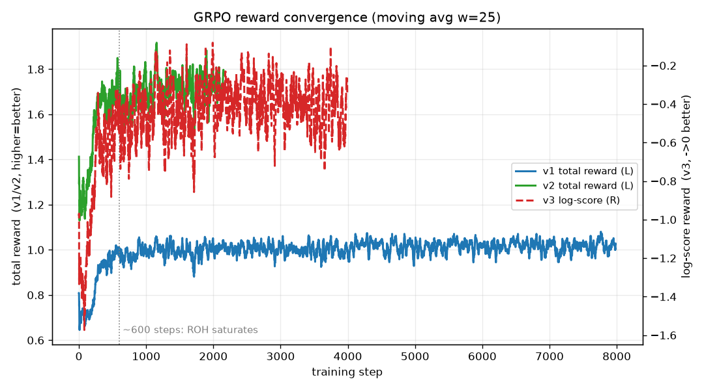
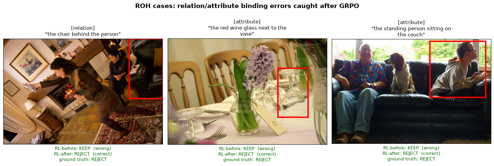
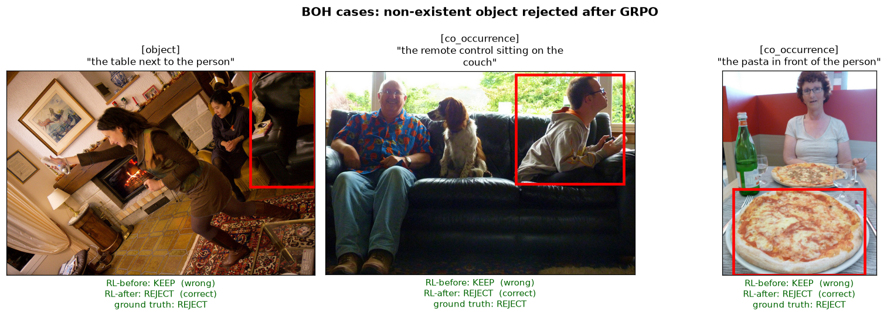

# V-SIGHT GRPO Verifier — 论文 Storyline

> 基于 vlm1 真实实验（Qwen2.5-VL-3B + ms-swift GRPO）。数字来自 500-dev 全量 4000-prompt
> 评测与逐样本 dump，以及 RefCOCOg-500 十一模型修复版评测。诚实标注正/负结果。

---

## 1. Introduction

### 1.1 问题定义

我们研究视觉指称定位（referring grounding）中的**幻觉修正**，并把幻觉按绑定层次分为两类：

- **BOH（Basic-Object Hallucination）**——目标物体不存在或类别错，属"物体在不在"的层面。
- **ROH（Relation/attribute-Object Hallucination）**——目标物体存在，但**属性或关系绑定错误**，
  例如"红酒杯**在花瓶里**""**站着**的人坐在沙发上"。属"绑定对不对"的层面。

评测建立在一个严格的反事实协议上：**500 个互不重复的图像组，每组一个固定的正表达式与 GT bbox，
外加 object / co_occurrence / attribute / relation 四类原子负表达式**；每个模型在 T1（判别 VQA，
是否存在）、T2（VQA + grounding，给框）、T4（描述后定位）三个任务上各产出 500 正查询 + 2000 负查询、
共 7500 条无推理错误记录。这一协议让 BOH（object、co_occurrence）与 ROH（attribute、relation）
可以在同一批图像上被直接、可比地量化。

**核心科学主张：grounding 能力 ≠ hallucination mitigation 能力，且 ROH 系统性地比 BOH 难。**

十一模型修复版评测把这个主张钉成了硬数字。在 **T1 判别**任务上，每个模型的 ROH 幻觉率都显著高于
BOH：ROH−BOH gap 从 UniVG-R1 的 11.3pp 一路到 Seg-zero 的 30.8pp，主流模型（Qwen3-VL 24.2pp、
Qwen2.5-VL 21.1pp、Orsta 22.7pp）普遍在 20pp 以上。也就是说，**即便模型能正确判断"物体在不在"，
它在"绑定对不对"上仍系统性地更容易被骗**。在 **T2 定位**任务上这个裂缝更触目：负查询的前景误定位率
（FG@Neg）在 ROH 上几乎全线逼近饱和——Seg-zero ROH-FG 98.9%、LENS 98.0%、UniVG-R1 99.9%，
而它们的 BOH-FG 明显更低；说明 RL 训练出来的 grounding 模型**只要被给一个不存在的关系/属性表达式，
几乎必然强行画出一个框**。这正是"生成正确 vs 定位正确是两种可分离的能力"的直接证据。

### 1.2 现有方法的不足

我们先系统性地证否了"便宜/train-free"这一整类路线（详见 `docs/updates_2026_09/NEGATIVE_RESULTS.md`）：
train-free 注意力信号对 ROH 的判别 AUROC 低于 0.5（反相关）、decoder-trajectory 近随机、
便宜检测器一阶信号对 BOH 尚可（AUROC 0.63–0.71）但对 ROH 只有 0.51–0.58（形同随机）、
在这些便宜信号上再训小 MLP/CLIP selector 也撞在 ~0.55 的天花板。结论收敛到一句话：
**ROH 内在需要 VLM 级的语义推理，任何绕开语义推理的廉价信号都对 ROH 无能为力**，
"单次推理预算 + train-free 即插即用"这个原始工程假设因此被自己的实验推翻。

### 1.3 方法提出

我们据此重新定位：**用一次可控的额外 VLM 验证，对上游 grounding 输出做选择性 KEEP/REJECT 修正；
并用可验证奖励的 GRPO 强化一个 3B verifier 的 ROH 判别力。** verifier 是 LoRA 微调的
Qwen2.5-VL-3B（r=8，仅 3.69M 可训练参数，占 0.098%），推理时单次前向；奖励完全可验证、
不依赖 reward model——决策命中反事实金标即得分，输出合法 typed-JSON 得小额格式分。
方法的诚实定位不是"零成本 train-free"，而是"一次轻量离线训练 + 推理单次预算 + human-in-the-loop 飞轮"。

---

## 2. RL Setting 与训练曲线

**Setting（三轮奖励迭代共用）**：基座 Qwen2.5-VL-3B-Instruct；框架 ms-swift 4.5.3 的 GRPO
（选它是因为 TRL 1.12 在 Qwen2.5-VL 上有 rope-index bug，经隔离实验确认是 TRL 而非 transformers 的问题）；
LoRA r=8/α=16 挂在 q/k/v/o_proj；训练数据由 1996-heldout 反事实对展开成 **15968 个平衡的 KEEP/REJECT
prompt**（各 7984，四类幻觉各 3992）；评测用 500-dev 全量 4000 prompt，**与训练集图像级零重叠**，
因此不是 train-on-test。采样 num_generations=8，全局 256 rollout/step，4×RTX4090 DDP，lr 1e-5、KL β=0.001。
奖励迭代：v1 二元决策 → v2 加 ROH×2 加权 + Brier 校准 → v3 把决策与校准合并成单一对数评分（proper scoring rule）。

**完整超参 / batch 设置：**

| 项 | 值 |
|---|---|
| 基座模型 | Qwen2.5-VL-3B-Instruct |
| 训练框架 | ms-swift 4.5.3，GRPO（`--rlhf_type grpo`） |
| 微调方式 | LoRA，r=8，α=16，target = q_proj/k_proj/v_proj/o_proj |
| 可训练参数 | 3.69M（占 0.098%），base 冻结，bf16 |
| per_device_train_batch_size | 8 |
| GPU 数 / 并行 | 4×RTX4090-24G，DDP 数据并行（NPROC_PER_NODE=4） |
| 全局 prompt batch | 8 × 4 = 32 prompt/step |
| num_generations（每 prompt rollout） | 8 |
| 有效 rollout/step | 32 × 8 = **256** |
| gradient_accumulation_steps | 1 |
| learning_rate | 1e-5 |
| KL 系数 β | 0.001 |
| 采样温度 | 1.0 |
| max_completion_length | 64 |
| gradient_checkpointing | true |
| epoch / max_steps | v1：2 epoch（7984 步）；v2/v3：1 epoch（3992 步） |
| save_steps / limit | v1 每 200；v2/v3 每 100，保留 8 |
| 训练集 | 15968 prompt（1996-heldout 反事实对，KEEP/REJECT 各 7984） |
| 评测集 | 500-dev 全量 4000 prompt（与训练集图像级零重叠） |

> 训练规模很轻：3B + 0.1% LoRA 参数、单卡显存 ~12GB、可验证奖励零 reward-model 开销。
> ROH 收益集中在前 600 步，因此 v2/v3 缩到 1 epoch 已足够覆盖饱和区。

**GRPO 收敛曲线（reward vs 训练步）：**

三轮的 total-reward 随步数变化（窗口 25 的移动平均）：v1/v2 为正向 reward（左轴，判对趋高），
v3 为对数评分（右轴，负值，判对趋近 0、判错趋于大负，两轴量纲不同不可直接比高低）；
共同特征是 reward 在前 ~300–600 步快速上升后进入平台，与 ROH 准确率 600 步饱和一致。
三条线步数不同是**有意为之**：v1 跑满 2 epoch（7984 步）后才发现 ROH 早已饱和且后期过训，
故 v3 缩到 1 epoch（3992 步）；v2 在结论明确（ROH 加权有效、Brier 校准塌缩）后于 ~2150 步手动停止，
把 GPU 让给 v3，不再空耗。

**训练曲线（500-dev 全量 decision 准确率）：**

| checkpoint | 步 | ALL | BOH | ROH |
|---|---|---|---|---|
| 零样本 | 0 | 0.689 | 0.748 | 0.631 |
| v1 峰值（ck1400） | 1400 | 0.723 | 0.766 | 0.680 |
| **v2 峰值（ck600）** | 600 | **0.747** | **0.796** | **0.698** |
| v3（ck1000） | 1000 | 0.730 | 0.770 | 0.690 |

**从曲线读出的三个结论，比表格本身更重要：**

**其一，ROH 可以被 GRPO 提升，但提升很快饱和。** ROH 从零样本 0.631 抬到约 0.68–0.70 几乎全部发生在
前 600 步（约 0.15 个 epoch），之后无论训到 1400 还是 7984 步都基本走平，甚至因过训略降。
这把"关系幻觉的难度"量化了：它不是训不动，而是训到 ~0.70 就撞墙——单纯堆 RL 步数无法突破，
指向需要关系层面的结构改进（role-conditioned 输入、关系联合损失），而非更多算力。

**其二，把 ROH 样本加权（v2 方向 A）确实有效。** 同样 600 步，v2 的 ROH（0.698）明显高于 v1（0.678），
证明 v1 的天花板一部分来自 ROH 梯度被大量简单 BOH 样本稀释；给 ROH 双倍权重后，学习信号不再被淹没。
当前最优就是 v2 ck600（ROH 0.698，已保护在 `saved_ckpts/v2_ck600`）。

**其三，也是最有价值的负结果：置信校准与 accuracy 在 GRPO 下此消彼长。** 飞轮的 DEFER 动作需要
verifier "知道自己何时不确定"。我们发现零样本 base 模型的 **decision-token 内部概率本来是有校准的**
——按它挑难例，判错样本的召回随阈值单调升到 1.0，明显高于误伤率；但**GRPO 在优化决策正确性的同时
使 decision token 分布熵坍缩**，训练后的模型对判对判错都给出极端置信，DEFER 几乎失效。Brier 与对数评分
（proper scoring rule）作为附加或合并奖励都拦不住这个塌缩，根因是 **GRPO 组内多数正确（~69%）
把置信整体拖向极端**，任何塞进同一标量奖励里的校准项都会被决策正确性压倒。这不是失败，而是一个清晰的
科学观察：**RLVR 提升判别力的代价是牺牲自知之明**——它直接指出飞轮的 DEFER 需要"决策用 GRPO 模型、
置信用 base 模型"的解耦，或组内 pairwise 校准，作为后续方向。

---

## 3. Case 可视化：RL 前后的修正

真实翻转统计（500-dev 全量，零样本 → GRPO）：**BOH 修好 292 例、弄坏 248 例，净 +44；
ROH 修好 373 例、弄坏 254 例，净 +119。ROH 的净修正量是 BOH 的约 2.7 倍**，且修好/弄坏比更高——
GRPO 的增益主要落在更难的 ROH 上，与"补 ROH 短板"的设计意图一致。下面每个 case 的红框是上游给出的
定位框，短语是被验证的指称表达；金标均为 REJECT（该框不该被这个短语接受），零样本误判 KEEP，GRPO 后纠正为 REJECT。

**ROH（关系/属性绑定错误——最能体现方法价值）：**

典型如"the wine glass **inside** the vase"（关系错：杯子在花瓶旁而非里面）、"the **standing** person
sitting on the couch"（属性错：人是坐着的）、"the chair **behind** the person"（关系错）。零样本
verifier 被物体确实存在所迷惑而 KEEP，GRPO 后学会了检查绑定本身、正确 REJECT。

**BOH（物体不存在——较易，但仍有净收益）：**

如"the ottoman next to the person""the remote control sitting on the couch"——所指物体在图中并不存在，
GRPO 后被正确拒绝。

> 图像源：vlm1 `$DATA/refcoco/train2014/`；渲染脚本 `render_cases.py`
> 从 `defer_zeroshot.jsonl` × `defer_v3ck1000.jsonl` 逐行对齐 500-dev 自动挑翻转 case。

### 3.1 Grounding 流程可视化（建议补图）

上游 grounding 模型输出 bbox → verifier 判 KEEP/REJECT。可补一张"候选池 + 验证"流程图：
GroundingDINO best-of-5 候选（recall 97% vs top-1 86%）叠加 verifier 最终决策，体现"生成候选 + 语义验证"两段式。

---

## 4. 对比的基线、模型与方法

**上游被测/被修正的 grounding 模型（十一模型评测）**：Qwen2.5-VL-7B、Qwen3-VL-8B、Visual-RFT、
Seg-Zero、Seg-R1、VisionReasoner、TreeVGR、Vision-R1、UniVG-R1、Orsta-7B、LENS（论文索引见
`papers/eval_models/INDEX.md`）。任务口径 T1=判别 VQA、T2=VQA+grounding、T4=描述后定位；
这批模型在模型级就展示了 11–31pp 的 ROH−BOH 幻觉率 gap，是问题定义的实证基础，也是 verifier 的上游输入来源。

**Verifier 方法的阶梯基线**（全部 500-dev 同口径）：便宜检测器一阶信号对 ROH ≈0.55（随机，负结果下界）→
在便宜信号上的小 MLP/CLIP/Qwen-LoRA selector 未过迁移门 → S2b/B1b 弱标签 LoRA verifier（画框 + graded
yes/no）把 ROH 判别抬到 AUROC 0.65–0.79 → B1c 集成为前序主结果（并救回塌陷的 Orsta，AUROC 0.565→0.714）。
本文的 RL 基线是零样本 3B 的 decision 准确率（ROH 0.631），最优是 **GRPO 3B verifier（v2 ck600，ROH 0.698，+6.7pp）**。

**奖励设计消融**：v1 二元（ROH 0.678）→ v2 ROH 加权 + Brier（ROH 0.698，校准塌缩）→ v3 对数评分合并
（ROH 0.690，校准仍塌缩）；置信来源对比显示"自报 confidence"全程塌缩，而"decision token 概率"
在零样本可用、GRPO 后被熵坍缩破坏。

---

## 5. 一句话 storyline

grounding ≠ hallucination mitigation，ROH 系统性比 BOH 难（十一模型 T1 判别 gap 达 11–31pp，
T2 负查询 ROH 误定位率逼近饱和）；train-free 与便宜信号对 ROH 无能为力。我们用可验证奖励的 GRPO
训练一个 3B verifier，把 ROH 判别从 0.631 提到 0.698、净修正 ROH 幻觉是 BOH 的 2.7 倍；
但发现 RLVR 的熵坍缩会摧毁 base 模型本有的置信校准，揭示 accuracy 与 calibration 在 RL 下的张力，
并为飞轮 DEFER 指出解耦 / pairwise 校准的后续路径。
