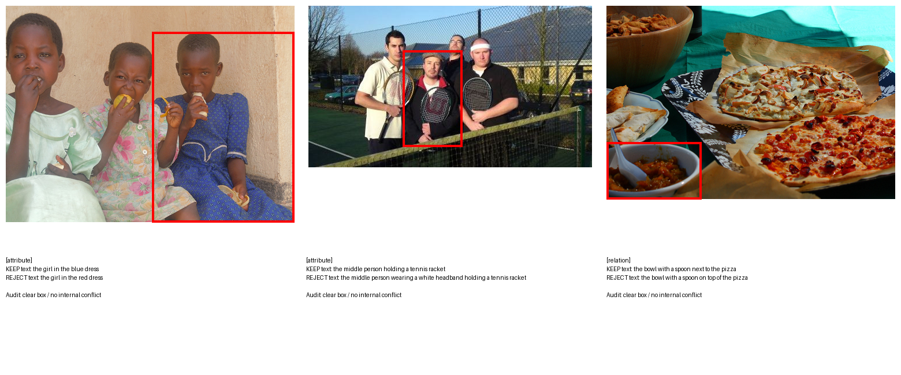
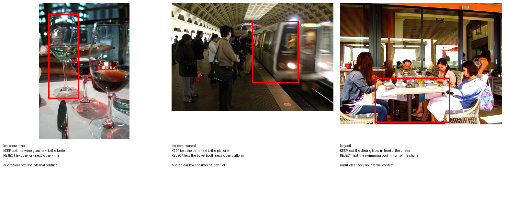

# V-SIGHT GRPO Verifier — 论文 Storyline

> 基于 vlm1 真实实验（Qwen2.5-VL-3B + ms-swift GRPO）。数字来自 500-dev 全量 4000-prompt
> 评测与逐样本 dump，以及 RefCOCOg-500 十一模型修复版评测。诚实标注正/负结果。

---

## 0. Abstract（当前版本草稿）

视觉指称定位模型不仅需要判断目标物体是否存在，还需要判断属性和空间关系是否正确绑定。我们将这两类错误区分为 BOH（Basic-Object Hallucination）和 ROH（Relation/attribute-Object Hallucination），并建立统一的反事实 benchmark，在同一图像组上分别评估 11 个 grounding 模型的判别与定位行为。修复版评测显示，ROH 在 T1 判别任务中系统性难于 BOH，T2 中对不存在的关系/属性表达式又常常出现强行定位。基于这一观察，我们构建一个包含反事实评测、候选框验证、选择性修正和人工回流的 V-SIGHT 框架，并分析其适用边界。

GRPO verifier 是当前正在进行的实验路线，而不是本文已定稿的核心贡献。为展示这条路线的可行性，本文报告当前最优开发集结果：Qwen2.5-VL-3B verifier 在 500-dev 全量 prompt 上的 ROH decision accuracy 从零样本 0.631 提升至 0.698。该结果仍需结合数据质量审核、独立测试和校准负结果解释，因此不将其表述为最终泛化结论。
## 0.1 当前论文贡献点（仅写已完成部分）

1. **问题定义**：将视觉 grounding 幻觉拆分为 BOH（物体存在性）与 ROH（属性/关系绑定），并给出统一的反事实判别口径。
2. **Benchmark 建立**：构建并修复 RefCOCOg-500 的 11-model 评测协议，明确 T1=判别 VQA、T2=VQA+grounding、T4=caption+grounding，使 BOH/ROH 可以在同一图像组上比较。
3. **框架与诊断**：建立从上游 grounding 输出到候选框验证、选择性过滤和人工回流的修正框架，并用实验定位“目标存在性判断”和“关系/属性绑定判断”的能力差异。

> GRPO verifier 仍处于实验阶段。本版只展示当前最优结果，不把 GRPO、校准策略或完整 agentic 飞轮写成已完成贡献；相关内容属于 ongoing experiments / negative-result analysis。
---

## 1. Introduction

### 1.1 问题定义

我们研究视觉指称定位（referring grounding）中的**幻觉修正**，并把幻觉按绑定层次分为两类：

- **BOH（Basic-Object Hallucination）**——目标物体不存在或类别错，属"物体在不在"的层面。
- **ROH（Relation/attribute-Object Hallucination）**——目标物体存在，但**属性或关系绑定错误**，
  例如"红酒杯**在花瓶里**""**站着**的人坐在沙发上"。属"绑定对不对"的层面。

评测建立在一个严格的反事实协议上：**500 个互不重复的图像组，每组一个固定的正表达式与 GT bbox，
外加 object / co_occurrence / attribute / relation 四类原子负表达式**；每个模型在 T1（判别 VQA，
是否存在）、T2（VQA + grounding，给框）、T4（描述后定位）三个任务上各产出 500 正查询 + 2000 负查询、
共 7500 条无推理错误记录。这一协议让 BOH（object、co_occurrence）与 ROH（attribute、relation）
可以在同一批图像上被直接、可比地量化。

**核心科学主张：grounding 能力 ≠ hallucination mitigation 能力，且 ROH 系统性地比 BOH 难。**

十一模型修复版评测把这个主张钉成了硬数字。在 **T1 判别**任务上，每个模型的 ROH 幻觉率都显著高于
BOH：ROH−BOH gap 从 UniVG-R1 的 11.3pp 一路到 Seg-zero 的 30.8pp，主流模型（Qwen3-VL 24.2pp、
Qwen2.5-VL 21.1pp、Orsta 22.7pp）普遍在 20pp 以上。也就是说，**即便模型能正确判断"物体在不在"，
它在"绑定对不对"上仍系统性地更容易被骗**。在 **T2 定位**任务上这个裂缝更触目：负查询的前景误定位率
（FG@Neg）在 ROH 上几乎全线逼近饱和——Seg-zero ROH-FG 98.9%、LENS 98.0%、UniVG-R1 99.9%，
而它们的 BOH-FG 明显更低；说明 RL 训练出来的 grounding 模型**只要被给一个不存在的关系/属性表达式，
几乎必然强行画出一个框**。这正是"生成正确 vs 定位正确是两种可分离的能力"的直接证据。

### 1.2 现有方法的不足

我们先系统性地证否了"便宜/train-free"这一整类路线（详见 `docs/updates_2026_09/NEGATIVE_RESULTS.md`）：
train-free 注意力信号对 ROH 的判别 AUROC 低于 0.5（反相关）、decoder-trajectory 近随机、
便宜检测器一阶信号对 BOH 尚可（AUROC 0.63–0.71）但对 ROH 只有 0.51–0.58（形同随机）、
在这些便宜信号上再训小 MLP/CLIP selector 也撞在 ~0.55 的天花板。结论收敛到一句话：
**ROH 内在需要 VLM 级的语义推理，任何绕开语义推理的廉价信号都对 ROH 无能为力**，
"单次推理预算 + train-free 即插即用"这个原始工程假设因此被自己的实验推翻。

### 1.3 方法框架与当前实验状态

我们提出 V-SIGHT 修正框架：上游 grounding 模型先产生候选框，随后由验证模块判断表达式与候选框的绑定是否成立，并根据 KEEP/REJECT/DEFER 或人工回流执行后续处理。框架的已完成部分是问题定义、benchmark、候选框验证和修正流程；它不假设任何单一 verifier 已经解决 ROH。

在此框架上，我们进一步探索 Qwen2.5-VL-3B 的 GRPO verifier。当前实验显示其在开发集上取得了正向的最优点，但训练数据质量、置信校准和独立泛化仍在验证。因此，GRPO 结果在本文中作为 ongoing experiment 的最佳观察点，而不是已经闭合的 agentic 飞轮贡献。
---

## 2. RL Setting 与训练曲线

**Setting（三轮奖励迭代共用）**：基座 Qwen2.5-VL-3B-Instruct；框架 ms-swift 4.5.3 的 GRPO
（选它是因为 TRL 1.12 在 Qwen2.5-VL 上有 rope-index bug，经隔离实验确认是 TRL 而非 transformers 的问题）；
LoRA r=8/α=16 挂在 q/k/v/o_proj；训练数据由 1996-heldout 反事实对展开成 **15968 个平衡的 KEEP/REJECT
prompt**（各 7984，四类幻觉各 3992）；评测用 500-dev 全量 4000 prompt，**与训练集图像级零重叠**，
因此不是 train-on-test。采样 num_generations=8，全局 256 rollout/step，4×RTX4090 DDP，lr 1e-5、KL β=0.001。
奖励迭代：v1 二元决策 → v2 加 ROH×2 加权 + Brier 校准 → v3 把决策与校准合并成单一对数评分（proper scoring rule）。

**完整超参 / batch 设置：**

| 项 | 值 |
|---|---|
| 基座模型 | Qwen2.5-VL-3B-Instruct |
| 训练框架 | ms-swift 4.5.3，GRPO（`--rlhf_type grpo`） |
| 微调方式 | LoRA，r=8，α=16，target = q_proj/k_proj/v_proj/o_proj |
| 可训练参数 | 3.69M（占 0.098%），base 冻结，bf16 |
| per_device_train_batch_size | 8 |
| GPU 数 / 并行 | 4×RTX4090-24G，DDP 数据并行（NPROC_PER_NODE=4） |
| 全局 prompt batch | 8 × 4 = 32 prompt/step |
| num_generations（每 prompt rollout） | 8 |
| 有效 rollout/step | 32 × 8 = **256** |
| gradient_accumulation_steps | 1 |
| learning_rate | 1e-5 |
| KL 系数 β | 0.001 |
| 采样温度 | 1.0 |
| max_completion_length | 64 |
| gradient_checkpointing | true |
| epoch / max_steps | v1：2 epoch（7984 步）；v2/v3：1 epoch（3992 步） |
| save_steps / limit | v1 每 200；v2/v3 每 100，保留 8 |
| 训练集 | 15968 prompt（1996-heldout 反事实对，KEEP/REJECT 各 7984） |
| 评测集 | 500-dev 全量 4000 prompt（与训练集图像级零重叠） |

> 训练规模很轻：3B + 0.1% LoRA 参数、单卡显存 ~12GB、可验证奖励零 reward-model 开销。
> ROH 收益集中在前 600 步，因此 v2/v3 缩到 1 epoch 已足够覆盖饱和区。

**GRPO 收敛曲线（reward vs 训练步）：**

三轮的 total-reward 随步数变化（窗口 25 的移动平均）：v1/v2 为正向 reward（左轴，判对趋高），
v3 为对数评分（右轴，负值，判对趋近 0、判错趋于大负，两轴量纲不同不可直接比高低）；
共同特征是 reward 在前 ~300–600 步快速上升后进入平台，与 ROH 准确率 600 步饱和一致。
三条线步数不同是**有意为之**：v1 跑满 2 epoch（7984 步）后才发现 ROH 早已饱和且后期过训，
故 v3 缩到 1 epoch（3992 步）；v2 在结论明确（ROH 加权有效、Brier 校准塌缩）后于 ~2150 步手动停止，
把 GPU 让给 v3，不再空耗。

**训练曲线（500-dev 全量 decision 准确率）：**

| checkpoint | 步 | ALL | BOH | ROH |
|---|---|---|---|---|
| 零样本 | 0 | 0.689 | 0.748 | 0.631 |
| v1 峰值（ck1400） | 1400 | 0.723 | 0.766 | 0.680 |
| **v2 峰值（ck600）** | 600 | **0.747** | **0.796** | **0.698** |
| v3（ck1000） | 1000 | 0.730 | 0.770 | 0.690 |

**从曲线读出的三个结论，比表格本身更重要：**

**其一，ROH 可以被 GRPO 提升，但提升很快饱和。** ROH 从零样本 0.631 抬到约 0.68–0.70 几乎全部发生在
前 600 步（约 0.15 个 epoch），之后无论训到 1400 还是 7984 步都基本走平，甚至因过训略降。
这把"关系幻觉的难度"量化了：它不是训不动，而是训到 ~0.70 就撞墙——单纯堆 RL 步数无法突破，
指向需要关系层面的结构改进（role-conditioned 输入、关系联合损失），而非更多算力。

**其二，把 ROH 样本加权（v2 方向 A）确实有效。** 同样 600 步，v2 的 ROH（0.698）明显高于 v1（0.678），
证明 v1 的天花板一部分来自 ROH 梯度被大量简单 BOH 样本稀释；给 ROH 双倍权重后，学习信号不再被淹没。
当前最优就是 v2 ck600（ROH 0.698，已保护在 `saved_ckpts/v2_ck600`）。

**其三，也是最有价值的负结果：置信校准与 accuracy 在 GRPO 下此消彼长。** 飞轮的 DEFER 动作需要
verifier "知道自己何时不确定"。我们发现零样本 base 模型的 **decision-token 内部概率本来是有校准的**
——按它挑难例，判错样本的召回随阈值单调升到 1.0，明显高于误伤率；但**GRPO 在优化决策正确性的同时
使 decision token 分布熵坍缩**，训练后的模型对判对判错都给出极端置信，DEFER 几乎失效。Brier 与对数评分
（proper scoring rule）作为附加或合并奖励都拦不住这个塌缩，根因是 **GRPO 组内多数正确（~69%）
把置信整体拖向极端**，任何塞进同一标量奖励里的校准项都会被决策正确性压倒。这不是失败，而是一个清晰的
科学观察：**RLVR 提升判别力的代价是牺牲自知之明**——它直接指出飞轮的 DEFER 需要"决策用 GRPO 模型、
置信用 base 模型"的解耦，或组内 pairwise 校准，作为后续方向。

---

## 3. Case 可视化：只展示语义清楚的翻转案例

当前 case 图中的部分例子存在数据质量风险，尤其是“standing person sitting on the bench”这类文本自相矛盾，以及可能存在指代不清或负例实际成立的样本。因此，旧 case 图不应直接作为论文证据。新版本只保留经过图像审核的高显著性案例，并在图注中明确：案例用于解释机制，不替代全量统计。

### 3.1 新 case 的筛选标准

每个展示案例必须同时满足：

- 红框完整覆盖目标，目标类别和主要属性清楚可见；
- 正表达式能在整图中唯一定位该目标；
- 负表达式只改变一个因素，且在整图中明确不成立；
- 负表达式不是通过同一对象的语法自相矛盾得到拒绝；
- relation 案例中的参照物真实存在、唯一可识别、关系方向明确；
- 至少经过一次独立带图审核；若审核结果为 uncertain，则不进入主图。

### 3.2 推荐的案例类型

**ROH 主图优先展示：**

1. 目标物体明确存在，但颜色/材质等属性与负表达式不符；
2. 目标和参照物都明确存在，但左右、前后、上下关系被反转；
3. 目标存在且框正确，但负表达式绑定到了另一实例，能清楚体现 instance binding，而不是文字荒诞性。

**BOH 对照图优先展示：**

1. 框内目标类别明确，负表达式替换为图中不存在的同类/近类物体；
2. 正确目标和负表达式中的新增伴随物都可在整图中核查；
3. 避免“camera-relative top/right”这类参考系不清的短语。

旧图中的 `standing person sitting on the bench`、无法确认参照物的 relation，以及任何模型审核为 uncertain 的样例，应从主文 case 图移除，转入数据质量附录。

### 3.3 统计结果（暂作为开发集观察）

在 500-dev 全量评测中，当前记录的最优 GRPO checkpoint 为 v2 ck600：ALL 0.747、BOH 0.796、ROH 0.698；零样本对应为 ALL 0.689、BOH 0.748、ROH 0.631。该结果只说明当前开发配方的最佳观察点，不能单独证明数据清洗后仍保持同样增益，也不能替代独立测试。

> 当前图片仅能作为工作版示意；在数据审核完成前，不把任何旧 case 作为论文正文证据。尤其移除“standing person sitting on the bench”、参照物不清和负例可能实际成立的样例。后续新图应从审核通过且具有真实 before/after 翻转证据的样本中重渲染。

## 4. 对比的基线、模型与方法

### 4.1 跨 positive-sample-only RL 上游的泛化性

V-SIGHT 的修正对象不是固定的单一 VLM，而是可以接在不同的上游 grounding 模型之后。我们将上游替换为多种采用正样本驱动 RL grounding 的视觉语言模型：LENS、Seg-zero、Qwen3-VL-8B 和 Orsta-7B，并采用 leave-one-model-out 的方式训练/校准修正器：每次留出一个上游模型作为未见测试域，其余模型只用于拟合。这样测到的是修正框架对上游模型分布变化的迁移，而不是在同一模型输出上调阈值。

最终的 B1c 集成结合了零训练融合特征和弱标签 LoRA verifier。在四个上游模型上的 BOH/ROH AUROC 分别为：LENS **0.911/0.779**、Seg-zero **0.904/0.765**、Qwen3-VL **0.861/0.817**、Orsta **0.714/0.643**。在 FNR≤3pp 的安全门下，B1c 的 BOH/ROH 捕获率分别为：LENS **0.633/0.327**、Seg-zero **0.593/0.299**、Qwen3-VL **0.790/0.681**、Orsta **0.133/0.104**。

这组结果支持一个窄而明确的泛化结论：**V-SIGHT 的候选框验证与过滤接口可以跨不同 positive-sample-only RL grounding 上游复用，并在未见上游模型上保留 ROH 判别信号。** 但它不是无条件的性能保证：Orsta 的 ROH 捕获率仍低，说明上游幻觉类型与训练负例分布不匹配时，修正器仍会退化；跨模型集成能够缓解，但不能消除该边界。

> 该结果证明的是“跨上游模型的修正框架泛化”，不是“每个上游模型都达到同一水平”。主文应同时报告四个模型和 Orsta 的负例，避免只展示 LENS/Seg-zero 的正向结果。

**上游被测/被修正的 grounding 模型（十一模型评测）**：Qwen2.5-VL-7B、Qwen3-VL-8B、Visual-RFT、
Seg-Zero、Seg-R1、VisionReasoner、TreeVGR、Vision-R1、UniVG-R1、Orsta-7B、LENS（论文索引见
`papers/eval_models/INDEX.md`）。任务口径 T1=判别 VQA、T2=VQA+grounding、T4=描述后定位；
这批模型在模型级就展示了 11–31pp 的 ROH−BOH 幻觉率 gap，是问题定义的实证基础，也是 verifier 的上游输入来源。

**Verifier 方法的阶梯基线**（全部 500-dev 同口径）：便宜检测器一阶信号对 ROH ≈0.55（随机，负结果下界）→
在便宜信号上的小 MLP/CLIP/Qwen-LoRA selector 未过迁移门 → S2b/B1b 弱标签 LoRA verifier（画框 + graded
yes/no）把 ROH 判别抬到 AUROC 0.65–0.79 → B1c 集成为前序主结果（并救回塌陷的 Orsta，AUROC 0.565→0.714）。
本文的 RL 基线是零样本 3B 的 decision 准确率（ROH 0.631），最优是 **GRPO 3B verifier（v2 ck600，ROH 0.698，+6.7pp）**。

**GRPO 当前最优结果（开发实验）**：v2 ck600 的 ALL/BOH/ROH 为 0.747/0.796/0.698，零样本为 0.689/0.748/0.631。该表用于记录当前最佳实验点；奖励消融、数据质量和校准负结果仍在整理，不在本版宣称为最终结论。

---

## 5. 一句话 storyline

grounding 不等于 hallucination mitigation：我们先用统一 benchmark 区分 BOH 与 ROH，并证明关系/属性绑定是独立且更困难的失败层；随后构建候选框验证与人工回流的 V-SIGHT 修正框架。GRPO verifier 的当前最优开发集结果为 ROH 0.631→0.698，但该路线仍处于实验和负结果攻克阶段，不作为已完成的最终贡献。

---

## 6. Related Work（定位坐标）

- **VLM grounding 与 RL grounding**：Qwen2.5-VL/Qwen3-VL、Seg-Zero、Visual-RFT、VisionReasoner、
  TreeVGR、UniVG-R1 等以 RL（IoU 奖励）训练定位。本文指出其共同盲区：**正样本-only 的 IoU 奖励
  从不惩罚"给不存在的目标画框"，导致对 ROH 近乎必然误定位**——把这批模型同时作为被测对象与被修正上游。
- **多模态幻觉评测**：现有多聚焦对象存在性（BOH 类）。本文用反事实 KEEP/REJECT 协议把评测细分到
  属性/关系绑定层（ROH），并证明二者可分离失败。
- **幻觉缓解的后处理 / verifier**：train-free 注意力（MTLA 类）、自一致、trajectory 探针——本文实证
  它们对 ROH 无判别力，主张 verifier 必须做 VLM 级语义验证。
- **可验证奖励 RL（RLVR）**：本文将 RLVR 用于"验证"而非"生成"，并报告一个此前少被强调的副作用——
  **RLVR 的熵坍缩破坏置信校准**，与选择性预测 / 校准文献接口。

## 7. Method（形式化，供 Method 章）

给定图像 $I$、指称短语 $q$、上游给出的候选框 $b$，verifier $\pi_\theta$ 输出结构化决策
$y=\langle \text{decision}\in\{\text{KEEP},\text{REJECT}\},\ \text{conf}\in[0,1]
angle$，其中 KEEP 表示
"$q$ 在 $b$ 上的绑定成立"。训练用 GRPO：对每个 prompt 采 $G=8$ 个 rollout，组内相对优势
$A_i=(r_i-\bar r)/\text{std}(r)$。奖励完全可验证、无 reward model：

- 格式奖励 $r_\text{fmt}=0.3\cdot\mathbb{1}[\text{合法 typed-JSON}]$；
- 决策奖励（三种消融）：
  - v1 二元 $r=\mathbb{1}[\text{decision}=y^\*]$；
  - v2 ROH 加权 $r=w\cdot\mathbb{1}[\cdot]$，$w=2$ if $q\in\{\text{attr,rel}\}$ else $1$，另加 Brier 校准项；
  - v3 proper scoring（决策+校准合一）$r=w\cdot(\ln c\ \text{if correct else}\ \ln(1-c))$，$c$ 裁剪到 $[0.05,0.95]$。

金标 $y^\*$ 来自反事实构造：正表达式→KEEP，四类原子负表达式→REJECT。推理时单次前向，
可选 DEFER：当置信低于阈值 $\tau$ 时交人工（本文发现 GRPO 后自报/内部置信均塌缩，DEFER 需另行修复）。

**飞轮定位**：verifier 挑出低置信/被 REJECT 的难例 → 人工二轮确认 → 回流重训。本文完成"引擎"
（可验证奖励训练）与"判别"（ROH 提升），DEFER 选择性交付这一环受校准坍缩制约，是闭环的当前瓶颈。

## 8. Limitations & Future Work

- **ROH 天花板 ~0.70**：单纯堆 RL 步数在 ~600 步饱和；突破需关系层面的结构改进（role-conditioned
  输入、target/reference 角色分离、关系联合损失），而非更多算力。
- **校准坍缩**：GRPO 熵坍缩使 DEFER 失效。候选修复：(a) 决策用 GRPO 模型、置信用 base 模型的
  decision-token 概率解耦；(b) 组内 pairwise 校准奖励（奖励"判对 conf > 判错 conf"的序关系，
  组内多数正确压不垮序关系）；(c) 更强 KL 约束抑制熵坍缩。
- **评测规模**：主评测 500-dev（4000 prompt）；1996-heldout 仅用于训练素材，最终大规模 held-out
  确认待补。SWITCH/RELOCALIZE（不止 REJECT、还给出正确框）依赖 reference-box 人工审核，尚未纳入。
- **batch 方差**：per-step 32 prompt 使 reward 曲线震荡大；正式跑应加大 batch 使曲线更干净可信。

## 9. 章节映射（写作导航）

| 论文章节 | 本文档来源 | 关键素材 |
|---|---|---|
| Abstract | §0 | 一段式,含 0.631→0.698、2.7×、校准坍缩 |
| Introduction | §1.1–1.3 | BOH/ROH 定义、11-model gap、便宜路线证否、方法提出 |
| Related Work | §6 | 四类坐标 |
| Method | §7 + §2 setting | 形式化 + 超参表 |
| Experiments-setup | §2 setting 表 | batch/超参/数据/评测口径 |
| Experiments-main | §2 曲线表 + 图 | 准确率曲线 + reward 收敛图 |
| Experiments-cases | §3 | ROH/BOH 翻转图 + 净修正统计 |
| Experiments-baselines | §4 | 阶梯基线 + 奖励消融 |
| Analysis/Negative | §2 其三 + §4 | 作为 ongoing experiment 的负结果，不列为当前贡献 |
| Limitations | §8 | 四条 |

> 资产位置：本目录 `figs/`（reward 曲线、ROH/BOH cases）、脚本
> `prep_1996_*.py / vsight_reward_plugin_v*.py / eval_defer*.py / render_*.py`；
> 训练/评测数字见 `TRAINING.md`；负结果全档见 `docs/updates_2026_09/NEGATIVE_RESULTS.md`。
